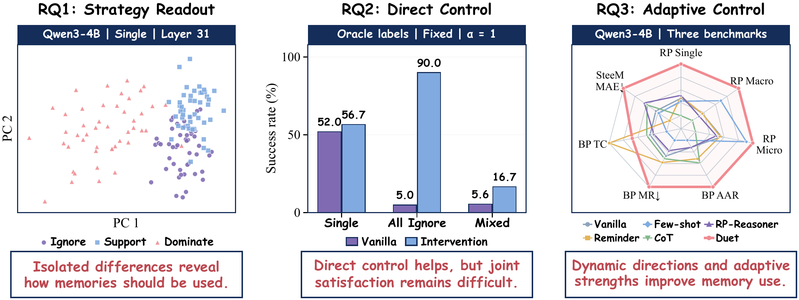

<div align="center">


## How Do Language Models Use Memory?<br>From Internal Strategy Readout to Adaptive Control


[](https://github.com/yulinlp/How-LLMs-Use-Memory)
[](https://github.com/yulinlp/How-LLMs-Use-Memory/commits)
[](#安装)

**[English](README.md) | [中文](README_zh.md)**

[工作介绍](#工作介绍) · [安装](#安装) · [实验](#实验)

</div>

本仓库提供论文的分析实验与方法实现。

<a id="工作介绍"></a>

## 💡 工作介绍

记忆增强助手不仅需要检索记忆，还需要判断这些记忆应该如何用于当前回答。
我们通过模型内部激活研究记忆的使用：能否读出使用策略，又能否利用这些信号控制生成？

实验围绕三个问题展开：

- **RQ1：能否读出使用策略？** 激活差分能够预测记忆的使用策略。在 Qwen3-4B 和 Qwen3-8B 上，单独提取每条记忆，比在多记忆背景下提取更有利于读出。
- **RQ2：能否直接控制生成？** 固定方向干预能够改善记忆使用，但仍难以同时满足混合使用要求；增大干预力度还可能导致重复生成。
- **RQ3：如何改善控制？** 基于这些发现，我们提出 **Duet**：在生成过程中更新每条记忆的干预方向，并根据输出分布的敏感度调整力度，无需更新模型参数。

<p align="center">
  
</p>

我们在 **RPEval、BenchPreS 和 SteeM** 上开展实验，分别覆盖离散使用策略、偏好适用性和分级记忆依赖。
实验使用六个骨干模型：Qwen3-4B、Qwen3-8B、Qwen3.5-4B、Qwen3.5-9B、
Llama-3.1-8B-Instruct 和 Llama-3.2-3B-Instruct。

<a id="安装"></a>

## 🔧 安装

在仓库根目录执行：

```bash
git clone https://github.com/yulinlp/How-LLMs-Use-Memory.git
cd How-LLMs-Use-Memory
python -m venv .venv
source .venv/bin/activate
python -m pip install -r requirements-reproduce.txt
python -m pip install -e .
```

完整实验需要兼容 CUDA 的 PyTorch。复现依赖中已固定 PyTorch 和 Transformers 版本，模型权重单独下载。

<a id="实验"></a>

## 🧪 实验

通过 [reproduce.py](reproduce.py) 运行 **RQ1、RQ2 和 Duet 主实验**。以下命令均在仓库根目录执行。

### 1. 准备数据

下载实验使用的上游版本。已存在的仓库不需要重复克隆。

```bash
git clone https://github.com/XueyangFeng/RPEval.git RPEval
git -C RPEval checkout --detach 0f8bce80a03e6b86426485264b14ae7de49cc8f9
git clone https://github.com/Moore-Tian/SteeM-Memory-Control.git SteeM-Memory-Control
git -C SteeM-Memory-Control checkout --detach fd3e20057a3c6359e1399cbc0258903803ee30d1

python reproduce.py prepare-data
python reproduce.py check-data
```

BenchPreS 从 Hugging Face 的 `sangyon/BenchPreS` 加载。离线使用时，在 `prepare-data` 后加
`--benchpres-parquet /path/to/test.parquet`。脚本校验上游文件及转换结果的哈希，
通过后保存到 `data/paper/`；数据版本不一致时会报错。

| Benchmark | 准备样本数 | Calibration 组数 | 主实验测试样本数 |
| :--- | ---: | ---: | ---: |
| RPEval | 300 | 15 | 285 |
| BenchPreS | 390 | 20 | 370 |
| SteeM | 1,000 | 10 | 950 |

划分保留完整 query group，SteeM 同一问题的五档依赖程度不会分开。
RQ2 使用全部 300 条 RPEval queries。固定划分见 [paper_splits.json](configs/paper_splits.json)。

### 2. 准备模型

```bash
hf download Qwen/Qwen3-4B --local-dir models/Qwen3-4B
```

`--model Qwen3-4B` 默认读取 `models/` 下的模型，也可以直接传入本地 checkpoint 路径。
通过 `DUET_MODEL_DIR` 更换模型根目录。其他五个骨干模型使用相同入口。

### 3. 运行实验

**RQ1：分层策略读出。** 提取激活，在 calibration 上选层，在其余 query group 上评测：

```bash
CUDA_VISIBLE_DEVICES=0 python reproduce.py rq1 \
  --model Qwen3-4B --benchmark rpeval
```

`runs/reproduction/rq1/` 下保存激活、逐层预测、读出指标与分层曲线图。
将 benchmark 改为 `benchpres` 或 `steem` 即可运行其他数据集；RPEval 还会保存配对的孤立读出结果。

**RQ2：直接干预。** 使用 oracle 策略，在 prefill 提取一次方向，随后每个生成步复用：

```bash
CUDA_VISIBLE_DEVICES=0 python reproduce.py rq2 \
  --model Qwen3-4B --alpha 1
```

力度扫描依次使用 `--alpha 0.25`、`0.5`、`0.75`、`1`、`1.5`、`2`。
`--alpha 0` 对应相同读出设置下的无干预对照。

**Duet：主实验。** 构建参考库、预测使用系数，再使用动态方向和自适应力度生成：

```bash
CUDA_VISIBLE_DEVICES=0 python reproduce.py main \
  --model Qwen3-4B --benchmark rpeval --alpha 1
```

在 `benchpres`、`steem` 上重复即可。加 `--plan` 可先查看命令而不加载模型；
`--limit 2 --max-new-tokens 32` 会将生成冒烟测试保存到单独目录。
相同配置可断点续跑；修改输入或设置后，请使用新的 `--output` 目录。

### 4. 评分与汇总

使用 **Qwen3.8-27B** 和各 benchmark 原生评测提示词。提供启用 `qwen3` reasoning parser
及确定性推理的 SGLang 服务，服务模型名设为 `Qwen/Qwen3.8-27B`。
若服务需要认证，设置环境变量 `DUET_JUDGE_API_KEY`。

在 `main` 或 `rq2` 命令后追加以下参数，即可边生成边评分：

```bash
--judge-endpoint http://localhost:8000/v1=8 --concurrency 8
```

重复添加 `--judge-endpoint` 可将请求分配到多个服务。生成结束后，入口等待评分完成并自动汇总指标。

<details>
<summary><b>对已有回复评分，或补评未完成的样本</b></summary>

```bash
python reproduce.py judge --benchmark rpeval \
  --input runs/reproduction/main/Qwen3-4B/rpeval/alpha1.jsonl \
  --output runs/reproduction/main/Qwen3-4B/rpeval/alpha1-judge \
  --judge-endpoint http://localhost:8000/v1=8 --concurrency 8

python reproduce.py summarize --benchmark rpeval \
  --input runs/reproduction/main/Qwen3-4B/rpeval/alpha1.jsonl \
  --judge-dir runs/reproduction/main/Qwen3-4B/rpeval/alpha1-judge \
  --output runs/reproduction/main/Qwen3-4B/rpeval/alpha1-metrics.json
```

评分默认开启 thinking；失败或无效的请求按相同标准关闭 thinking 重试，并记录每次请求设置。
重新执行会保留有效评分，只补未完成项。汇总明确列出缺失数量，RPEval 同时报告 Single、Multi、
All Ignore、Mixed 和重复生成统计。

</details>

### 验证

```bash
python -m unittest discover -s tests -p test_reproduction.py -v
python scripts/check_reproduction.py
python scripts/compass_matrix_judge.py --self-test
```

已使用新建 Python 环境和独立源码副本验证：随机小模型的读出与生成、三个 benchmark 的输入格式、
RQ1 分析、断点续跑和模拟 judge 请求。原始数据重建后通过论文输入哈希校验。
这些检查不等同于重新完成大模型 GPU 全量复跑。上述入口生成 Duet 和 RQ2 对照，不包含主表的五种 prompting baseline。

## 📁 目录结构

```text
assets/        README 配图
configs/       固定输入、上游版本与 calibration ID
reproduce.py   实验统一入口
steem_adapt/   数据处理、提示词与模型干预
scripts/       实验运行、评测与绘图
tests/         测试
```

## 致谢

实现基于修改后的 [EasySteer](https://github.com/ZJU-REAL/EasySteer)，
自适应力度部分借鉴了 [Dynamic Activation Composition](https://aclanthology.org/2024.blackboxnlp-1.34/)。
感谢本文使用的模型与 benchmark 的作者。

## 许可证

本项目原创代码采用 [Apache-2.0](LICENSE) 许可证。
第三方代码、数据集和模型权重保留各自许可证，详见[第三方声明](THIRD_PARTY_NOTICES.md)。
